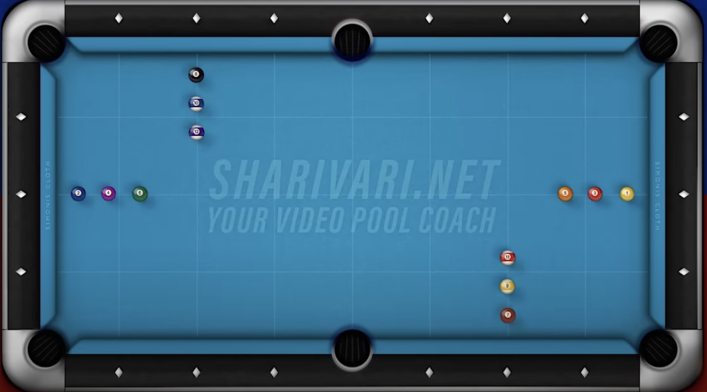

We've been playing American pool in Hong Kong for a while now. Today, my friend, HLM Tô found a way to book cheap pool tables from LCSD. So we decided to practice more seriously.

I will try to plan our practice in the next few weeks and keep track of our progress in this series.

## The big todo list 
In my oppinion, we need to practice the following things:
1. Develop a consistent pre-shot routine
1. Shoot straight.
1. Stun, follow, draw.
1. Position play with central ball natural angle.
1. Simple half table 3 balls clear.
1. Some more advanced position play with english.
1. Full table 3 balls clear.
1. Full table 6 balls clear without rotation.
1. Full table 6 balls clear with rotation.
1. Full table 9 balls clear with rotation.
1. Break and run.

## October 2024 drill
This month, we will focus on developing a consistent pre-shot routine, shooting straight for all center ball shots.

The end goal for this month is to complete this drill: 
<iframe width="560" height="315" src="https://www.youtube.com/embed/XwalbgDfxds?si=tkuvd3lkiL39QJsY" title="YouTube video player" frameborder="0" allow="accelerometer; autoplay; clipboard-write; encrypted-media; gyroscope; picture-in-picture; web-share" referrerpolicy="strict-origin-when-cross-origin" allowfullscreen></iframe>

Drill description:

Group A: 1, 3, 5

Group B: 8, 10, 12

Group C: 2, 4, 6

Group D: 7, 9, 11

- Level 1: Clear Group A, then Group B, then Group C and Group D. You can play a random order inside the groups.

- Level 2: Same as level one but in numerical order inside the group.

- Level 3: Always clear one ball from a random group and then switch to the next one. Once every group has three balls left, do the same until each group has only two balls left and so on.

- Level 4: Clear random balls switching between group A and C. After every ball is pocketed, do the same starting with Group C and D.

- Level 5: Same as in this video (play from 1 to 12)

- Level 6 (Ultra Hard): Play the balls in the following order: 1, 7, 3, 9, 5, 11, 2, 8, 4, 10, 6, 12

## The plan

For each practice session, we will:
1. 5 minutes pre-shot routine, without hitting the cue ball.
1. 15 minutes shooting straight stun shots half table.
1. 15 minutes shooting straight follow shots half table.
1. 15 minutes shooting straight draw shots half table.

Then do the drill for 30 minutes.

The remaining time will be used for free play.

