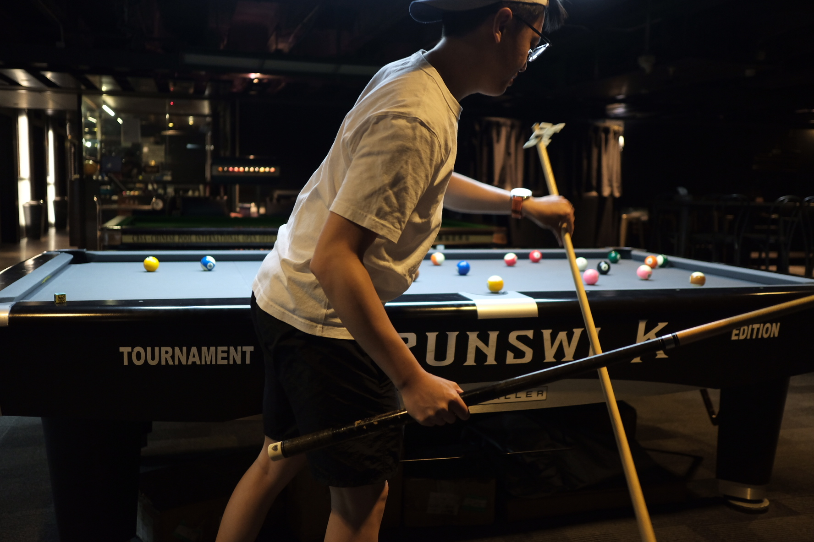

We decided to play billiard. It was really hard to find a place to play American pool in Hong Kong since people here prefer to play snooker. We finally found a place in Hok Yuen Street, Hung Hom. The place is called Sun Mong Club.

The place is really big and have been hosting several tournaments. Half of it is for snooker and the other half is for American pool. The tables are well maintained and the staffs are friendly.

We paid around HKD120 per hour, which is quite expensive compared to Vietnam. But we had a great time. 

We might consider playing regularly here. Indeed, we decided to play again tomorrow morning.

My todo list for getting better at billiard:
- Develop a consistent pre-shot routine
- Improve my stance and stroke
- Summarize some techniques and practice them

I think I will write a small series about billiard on this blog. Stay tuned!