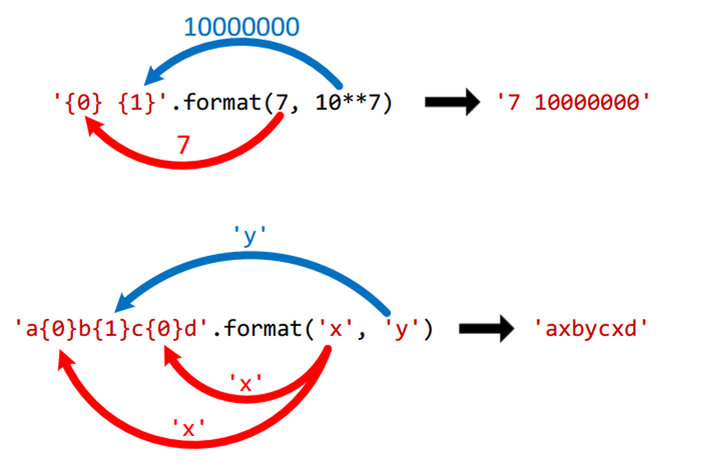
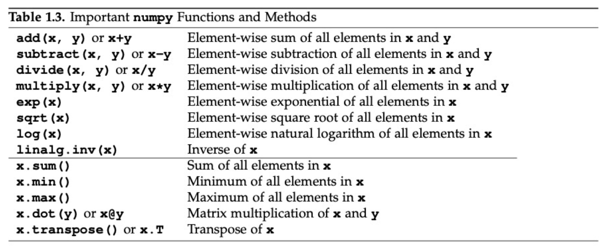
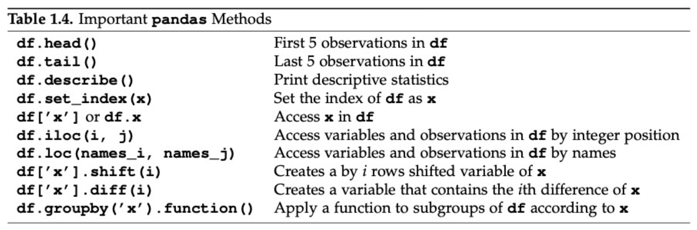

<!-- #region id="sNA6__iA_eck" -->
# Một số phép tính và khái niệm cơ bản trong Python
<!-- #endregion -->

<!-- #region id="mHwc7XOaCe5S" -->
### Các kiểu dữ liệu cơ bản
- Kiểu int: Kiểu số nguyên (không có chứa dấu chấm thập phân), có thể lưu các số nguyên âm và dương. Ví dụ: 113, -114
- Kiểu float: Kiểu số thực (có chứa dấu chấm thập phân), ví dụ: 5.2, -7.3
- Kiểu complex: Kiểu số phức,
ví dụ 1: z = 2+3j thì 2 là phần thực, 3 là phần ảo (j là từ khóa để đánh dấu phần ảo)
ví dụ 2: z=complex(2,3) thì 2 là phần thực, 3 là phần ảo, khi xuất kết quả ta có thể xuất:
print(“Phần thực = “,z.real) ==> Phần thực = 2
print(“Phần ảo = “,z.imag) ==> Phần ảo = 3


<!-- #endregion -->

```python colab={"base_uri": "https://localhost:8080/"} id="a8kWAmTLAp6j" outputId="15b9bacb-8873-4b09-8234-f8f06b4d08d1"
z = complex(2,3)
print('Phần thực = ',z.real)
print('Phần ảo = ',z.imag)
```

<!-- #region id="rs-v5UvoC-10" -->
- Kiểu str: Kiểu chuỗi, để trong nháy đôi hoặc nháy đơn. Ví dụ: “Obama”, ‘Putin’
- Kiểu bool: Kiểu luận lý, để lưu True hoặc False. Ví dụ 1: t1=True. Ví dụ 2: t2=False

<!-- #endregion -->

```python colab={"base_uri": "https://localhost:8080/"} id="014N-1SQDInE" outputId="b5a85f43-889d-499b-e3a5-ee5b84a867f0"
t1=True
print(t1)
```

```python colab={"base_uri": "https://localhost:8080/"} id="J79oa18UDUI5" outputId="0279ca6b-1591-4052-d99c-f807308819ae"
# Có thể dùng hàm type để xem kiểu dữ liệu của biến
# Dùng phép tính dạng biến = giá trị để gán giá trị cho biến
x=5
print(type(x))
x='teo'
print(type(x))
x=True
print(type(x))
x=5.5
print(type(x))
x=complex(113,114)
print(type(x))

```

```python colab={"base_uri": "https://localhost:8080/", "height": 200} id="WSM65c6rDkRa" outputId="386dbc13-5611-4b42-bdf4-01bcb65e3674"
# Xoá biến bằng del biến
del x
print(x)
```

```python colab={"base_uri": "https://localhost:8080/", "height": 35} id="sodlyqSYDqA2" outputId="c925cc18-2066-4476-c49c-6ca82c4dd895"
# Ghi chú một dòng
# ghi thêm
# dòng
# ở đây

"""
Ghi chú
nhiều dòng
kiểu 1
"""

'''
Ghi chú 
nhiều dòng
kiểu 2
'''
```

<!-- #region id="DvPOt7doD7zX" -->
### Các phép toán số học cơ bản
<!-- #endregion -->

```python colab={"base_uri": "https://localhost:8080/"} id="caaUU3xVEFaw" outputId="3c002d52-1e8d-4d7e-a3f8-6b3319765575"
a = 8
b = 5
# Cộng +
print(a + b)
# Trừ -
print(a - b)
# Nhân *
print(a * b)
# Chia /
print(a / b)
# Chia lấy phần nguyên //
print(a // b)
# Chia lấy phần dư %
print(a % b)
# Luỹ thừa **
print(a ** b)
```

<!-- #region id="jyRFjDCeXBTN" -->
Bài tập nhỏ:
Gán biến age = Tuổi của em.
Gán biến lover = Tuổi của người yêu em/người em yêu/người em dự định sẽ yêu/ngẫu nhiên.
Tính: Tổng/Tích tuổi của em và lover. Tính Tuổi của em mũ tuổi của lover rồi in kết quả ra màn hình.
<!-- #endregion -->

<!-- #region id="GDm8IhF8EfAR" -->
### Các phép toán gán
<!-- #endregion -->

```python colab={"base_uri": "https://localhost:8080/"} id="cNPpZeVyEgi-" outputId="f07d77c4-1c87-456f-c9d1-a38890ae76d8"
# = là gán giá trị vế bên phải cho vế bên trái
a = 5
b = 2
x = 'x là '
print(f'a là: {a}')
print('b là: ', b)
print(type(x))
# += là phép cộng và gán
a+=3
# tương đương với a = a + 3
print('a+=3: ',a)
# -= là phép trừ và gán
a-=3
# tương đương với a = a - 3
print('a-=3: ',a)
# *= là phép nhân và gán
a*=3
print('a*=3: ',a)
# /= là phép nhân và gán
# //= là phép chia lấy nguyên và gán
# %= là phép chia lấy dư và gán
# **= là phép lấy luỹ thừa và gán

```

<!-- #region id="k_cgveWiFwOD" -->
### Các phép toán so sánh
<!-- #endregion -->

```python id="Tl7hQFGIFyIL"
# == so sánh bằng
# != so sánh khác (không bằng)
# < so sánh nhỏ hơn
# <= so sánh nhỏ hơn hoặc bằng
# > so sánh lớn hơn
# >= so sánh lớn hơn hoặc bằng
# is trả về kết quả dạng bool cho biết 2 vế có cùng trỏ về 1 giá trị
#hoặc một đối tượng không, nếu cùng trả về True
# is not trả về kết quả dạng bool cho biết 2 vế có cùng trỏ về 1 giá trị
#hoặc một đối tượng không, nếu cùng trả về False
```

<!-- #region id="cnXZWYP_GMxV" -->
### Cho người dùng nhập dữ liệu trong Python
<!-- #endregion -->

```python colab={"base_uri": "https://localhost:8080/"} id="XV3Me8CMGQnd" outputId="857ce3bb-01b4-44d7-d95a-657b6825cc22"
# input()
print('Tên của bạn là gì?')
name = input()
print('Xin chào, ',name, ' nhé!')
```

```python colab={"base_uri": "https://localhost:8080/"} id="dQ6no1h3GcxD" outputId="c5b409d6-c4c7-4443-90a5-b0f88a5c1d92"
# Đưa dữ liệu người dùng nhập về 1 kiểu data
print('Bạn bao nhiêu tuổi?')
age = int(input())
next_age = age + 1
print(f'Năm sau là bạn đã {next_age} tuổi rồi đấy!')
print(type(age))
```

<!-- #region id="Aj7nsCu_G0kg" -->
### Xuất dữ liệu ra màn hình
<!-- #endregion -->

<!-- #region id="Jw8TfP7HHGel" -->


```python colab={"base_uri": "https://localhost:8080/"} id="Wv53gvMzG2vU" outputId="f8d7b679-7c67-484a-983b-f63d0adf6f45"
print('-'*15)
print('{0:>2} {1:>11}'.format('STT', 'Giá trị'))
print('{0} {1}'.format('STT', 'Giá trị'))
print('-'*15)
print('{0:>2} {1:>11}'.format(1, 10**10))
print('{0:>2} {1:>11}'.format(2, 10**9))
print('{0:>2} {1:>11}'.format(3, 10**8))
print('{0:>2} {1:>11}'.format(4, 10**7))
print('{0:>2} {1:>11}'.format(5, 10**6))
print('{0:>2} {1:>11}'.format(6, 10**5))
print('{0:>2} {1:>11}'.format(7, 10**4))
print('{0:>2} {1:>11}'.format(8, 10**3))
print('{0:>2} {1:>11}'.format(9, 10**2))
print('{0:>2} {1:>11}'.format(10, 10**1))
print('-'*15)
```

<!-- #region id="OKEAl8ek9FZp" -->
# Cài đặt dữ liệu mẫu trong sách và sử dụng một số thư viện quan trọng trong kinh tế lượng
<!-- #endregion -->

<!-- #region id="qqgtq__rMRNR" -->
Đầu tiên cần cài đặt bộ dữ liệu trong sách Wooldridge
<!-- #endregion -->

```python colab={"base_uri": "https://localhost:8080/"} id="FuvOARueMPnN" outputId="d8cb122d-325c-47cf-d7ee-0b5f9c0bff54"
!pip install wooldridge
```

<!-- #region id="HTl9ZUqQMtIk" -->
Import một số thư viện cần dùng
<!-- #endregion -->

```python id="DJaIImbPMceH"
# Import thư viện Wooldridge, là data mẫu theo sách giáo trình
# Phần as ... là đặt alias cho thư viện
import wooldridge as woo
# Thư viện numpy, pandas chứa các phép toán cần dùng
import numpy as np
import pandas as pd
# Thư viện matplotlib để vẽ biểu đồ
import matplotlib.pyplot as plt
```

```python colab={"base_uri": "https://localhost:8080/"} id="t3zgluDWM5Hw" outputId="5ee4f1a8-37ca-4144-8063-761cb0b4d6c3"
# Lấy data WAGE1 của sách Wooldridge
wage1 = woo.data('wage1')
# In data ra xem thử
print(wage1)
```

```python colab={"base_uri": "https://localhost:8080/", "height": 394} id="tfaypyyZNuPy" outputId="8107a66d-19e2-4f48-e5e3-73d4643ee326"
# Sử dụng .describe() để có được thống kê mô tả
wage1.describe()

```

<!-- #region id="QfJZkxt6VK-a" -->
Một số lệnh quan trọng trong thư viện numpy
<!-- #endregion -->



<!-- #region id="33tHM2A4VOZL" -->
Một số lệnh quan trọng trong thư viện pandas
<!-- #endregion -->

<!-- #region id="60igzvp4VQ8-" -->


```python colab={"base_uri": "https://localhost:8080/"} id="vN2X3rVbku9m" outputId="e784df47-9a15-4e90-b6f5-ac315fe9ee4b"
wage1['female']
```

```python colab={"base_uri": "https://localhost:8080/"} id="b7uRSZVIS6D8" outputId="32502bb6-5ab8-4f6d-eb44-1ea480a7c44d"
# data['Tên'] để lấy dữ liệu của cột/biến bất kì trong data
print('Dữ liệu cột wage')
print(wage1['wage'])
# data[i: (j+1)] để lấy dữ liệu dòng/quan sát thứ i đến j
print('Dữ liệu dòng 1-3')
print(wage1[0:3])
# data.loc['Ten dong', 'Ten cot'] để lấy dữ liệu tại đúng toạ độ
print('Dữ liệu dòng 4, cột tenure')
print(wage1.loc[3,'tenure'])
# data.iloc[i, j] để lấy dữ liệu tại đúng toạ độ dòng i, cột j
print('Dữ liệu dòng 4, cột 4')
print(wage1.iloc[3,3])
```

<!-- #region id="6d5AntknVzx3" -->
### Bài tập C1
Use the data in WAGE1.RAW for this exercise.
1. Find the average education level in the sample. What are the lowest and highest years of education?
2. Find the average hourly wage in the sample. Does it seem high or low?
3. The wage data are reported in 1976 dollars. Using the Economic Report of the President (2011 or later), obtain and report the Consumer Price Index (CPI) for the years 1976 and 2010.
4. Use the CPI values from part (iii) to find the average hourly wage in 2010 dollars. Now does the average hourly wage seem reasonable?
5. How many women are in the sample? How many men?
<!-- #endregion -->

```python colab={"base_uri": "https://localhost:8080/"} id="4sP_aik_V1Vj" outputId="c26e0f61-c20a-4b18-fa34-acc5297c0efd"
# Câu C1.1
print(wage1['educ'].describe())
print(wage1['educ'].min())
print(wage1['educ'].max())
print(wage1['educ'].mean())
```

```python colab={"base_uri": "https://localhost:8080/"} id="uyV4wEnmWQBM" outputId="1bf99c14-68eb-4b86-d1cb-f31d48144a3c"
# Câu C1.2
print(wage1['wage'].mean())
```

```python colab={"base_uri": "https://localhost:8080/"} id="GjckZko3Wh3n" outputId="f39dab9c-7c72-4155-e2cf-060d8e7de4bb"
# câu C1.5
# Đếm số nữ có trong data
female = wage1['female'].sum()
# Đếm tổng số nam và nữ trong data
f_and_m = len(wage1['female'])
print('Số nữ trong data: ',female,'\n')
print('Số nam trong data: ',f_and_m - female,'\n')
```

<!-- #region id="D7YfO_l9Y3mv" -->
### Bài tập C2
Data: BWGHT.RAW to answer
1. How many women are in the sample, and how many report smoking during
pregnancy?
2. What is the average number of cigarettes smoked per day? Is the average a good
measure of the “typical” woman in this case? Explain.
3. Among women who smoked during pregnancy, what is the average number
of cigarettes smoked per day? How does this compare with your answer from
part (ii), and why?
4. Find the average of fatheduc in the sample. Why are only 1,192 observations used
to compute this average?
5. Report the average family income and its standard deviation in dollars.
<!-- #endregion -->

```python colab={"base_uri": "https://localhost:8080/"} id="FtGxKBtfY_VV" outputId="71924217-0051-491d-8adb-28d09b3a1064"
# C2 import data
c2data = woo.data('bwght')
c2data_des = woo.data('bwght', description=True)
```

```python colab={"base_uri": "https://localhost:8080/"} id="-GIFyKG0Z0ii" outputId="207781d4-2314-438e-caf2-aaeac06bb194"
# C2.1
# Số phụ nữ trong quan sát
n_of_female = len(c2data['male']) - c2data['male'].sum()
print(n_of_female)

# Số hút thuốc 
print(np.sum(c2data['cigs'] != 0))
```

```python colab={"base_uri": "https://localhost:8080/"} id="euGVc7eDbhqB" outputId="126df0e0-27fe-488e-da4c-eb9027afd0c1"
# C2.2
# Số thuốc hút trung bình
print(c2data['cigs'].mean())
```

```python colab={"base_uri": "https://localhost:8080/"} id="E8n1IVr_bpoK" outputId="638121fb-f1c5-43b1-b3cf-b5c5c730ac04"
# C2.3
# Sử dụng pandas pivot table để tái tạo hàm sumifs
print(pd.pivot_table(c2data, values='cigs', columns='male', aggfunc=np.mean))
```

```python colab={"base_uri": "https://localhost:8080/"} id="YroqZXDCfXrT" outputId="4637d9ba-5863-4558-963d-6e5c55dc0151"
# C2.4
# Trung bình của fatheduc
print(np.mean(c2data['fatheduc']))
print(c2data['fatheduc'].notnull().sum())
```

```python colab={"base_uri": "https://localhost:8080/"} id="zjA5F70Sf9I4" outputId="76c02c5f-31e4-434f-c336-34729ac8e7f9"
print('average: ', c2data['faminc'].mean())
print('stdev: ', np.std(c2data['faminc']))
```

<!-- #region id="Y9MVjTa4_Zpw" -->

<!-- #endregion -->

<!-- #region id="DdfmfWLM_ite" -->

<!-- #endregion -->

```python colab={"base_uri": "https://localhost:8080/"} id="J_4Ub7h3Rnnq" outputId="dd9d27c3-b84f-4f46-e1a7-0ad40113ac3b"
print('Toi ten la Long')
```

<!-- #region id="pyW9TUlSN320" -->
# Hồi quy với dữ liệu thật
<!-- #endregion -->

<!-- #region id="wtlY4ONBzNIK" -->
# New Section
<!-- #endregion -->

```python colab={"base_uri": "https://localhost:8080/", "height": 73, "resources": {"http://localhost:8080/nbextensions/google.colab/files.js": {"data": "Ly8gQ29weXJpZ2h0IDIwMTcgR29vZ2xlIExMQwovLwovLyBMaWNlbnNlZCB1bmRlciB0aGUgQXBhY2hlIExpY2Vuc2UsIFZlcnNpb24gMi4wICh0aGUgIkxpY2Vuc2UiKTsKLy8geW91IG1heSBub3QgdXNlIHRoaXMgZmlsZSBleGNlcHQgaW4gY29tcGxpYW5jZSB3aXRoIHRoZSBMaWNlbnNlLgovLyBZb3UgbWF5IG9idGFpbiBhIGNvcHkgb2YgdGhlIExpY2Vuc2UgYXQKLy8KLy8gICAgICBodHRwOi8vd3d3LmFwYWNoZS5vcmcvbGljZW5zZXMvTElDRU5TRS0yLjAKLy8KLy8gVW5sZXNzIHJlcXVpcmVkIGJ5IGFwcGxpY2FibGUgbGF3IG9yIGFncmVlZCB0byBpbiB3cml0aW5nLCBzb2Z0d2FyZQovLyBkaXN0cmlidXRlZCB1bmRlciB0aGUgTGljZW5zZSBpcyBkaXN0cmlidXRlZCBvbiBhbiAiQVMgSVMiIEJBU0lTLAovLyBXSVRIT1VUIFdBUlJBTlRJRVMgT1IgQ09ORElUSU9OUyBPRiBBTlkgS0lORCwgZWl0aGVyIGV4cHJlc3Mgb3IgaW1wbGllZC4KLy8gU2VlIHRoZSBMaWNlbnNlIGZvciB0aGUgc3BlY2lmaWMgbGFuZ3VhZ2UgZ292ZXJuaW5nIHBlcm1pc3Npb25zIGFuZAovLyBsaW1pdGF0aW9ucyB1bmRlciB0aGUgTGljZW5zZS4KCi8qKgogKiBAZmlsZW92ZXJ2aWV3IEhlbHBlcnMgZm9yIGdvb2dsZS5jb2xhYiBQeXRob24gbW9kdWxlLgogKi8KKGZ1bmN0aW9uKHNjb3BlKSB7CmZ1bmN0aW9uIHNwYW4odGV4dCwgc3R5bGVBdHRyaWJ1dGVzID0ge30pIHsKICBjb25zdCBlbGVtZW50ID0gZG9jdW1lbnQuY3JlYXRlRWxlbWVudCgnc3BhbicpOwogIGVsZW1lbnQudGV4dENvbnRlbnQgPSB0ZXh0OwogIGZvciAoY29uc3Qga2V5IG9mIE9iamVjdC5rZXlzKHN0eWxlQXR0cmlidXRlcykpIHsKICAgIGVsZW1lbnQuc3R5bGVba2V5XSA9IHN0eWxlQXR0cmlidXRlc1trZXldOwogIH0KICByZXR1cm4gZWxlbWVudDsKfQoKLy8gTWF4IG51bWJlciBvZiBieXRlcyB3aGljaCB3aWxsIGJlIHVwbG9hZGVkIGF0IGEgdGltZS4KY29uc3QgTUFYX1BBWUxPQURfU0laRSA9IDEwMCAqIDEwMjQ7CgpmdW5jdGlvbiBfdXBsb2FkRmlsZXMoaW5wdXRJZCwgb3V0cHV0SWQpIHsKICBjb25zdCBzdGVwcyA9IHVwbG9hZEZpbGVzU3RlcChpbnB1dElkLCBvdXRwdXRJZCk7CiAgY29uc3Qgb3V0cHV0RWxlbWVudCA9IGRvY3VtZW50LmdldEVsZW1lbnRCeUlkKG91dHB1dElkKTsKICAvLyBDYWNoZSBzdGVwcyBvbiB0aGUgb3V0cHV0RWxlbWVudCB0byBtYWtlIGl0IGF2YWlsYWJsZSBmb3IgdGhlIG5leHQgY2FsbAogIC8vIHRvIHVwbG9hZEZpbGVzQ29udGludWUgZnJvbSBQeXRob24uCiAgb3V0cHV0RWxlbWVudC5zdGVwcyA9IHN0ZXBzOwoKICByZXR1cm4gX3VwbG9hZEZpbGVzQ29udGludWUob3V0cHV0SWQpOwp9CgovLyBUaGlzIGlzIHJvdWdobHkgYW4gYXN5bmMgZ2VuZXJhdG9yIChub3Qgc3VwcG9ydGVkIGluIHRoZSBicm93c2VyIHlldCksCi8vIHdoZXJlIHRoZXJlIGFyZSBtdWx0aXBsZSBhc3luY2hyb25vdXMgc3RlcHMgYW5kIHRoZSBQeXRob24gc2lkZSBpcyBnb2luZwovLyB0byBwb2xsIGZvciBjb21wbGV0aW9uIG9mIGVhY2ggc3RlcC4KLy8gVGhpcyB1c2VzIGEgUHJvbWlzZSB0byBibG9jayB0aGUgcHl0aG9uIHNpZGUgb24gY29tcGxldGlvbiBvZiBlYWNoIHN0ZXAsCi8vIHRoZW4gcGFzc2VzIHRoZSByZXN1bHQgb2YgdGhlIHByZXZpb3VzIHN0ZXAgYXMgdGhlIGlucHV0IHRvIHRoZSBuZXh0IHN0ZXAuCmZ1bmN0aW9uIF91cGxvYWRGaWxlc0NvbnRpbnVlKG91dHB1dElkKSB7CiAgY29uc3Qgb3V0cHV0RWxlbWVudCA9IGRvY3VtZW50LmdldEVsZW1lbnRCeUlkKG91dHB1dElkKTsKICBjb25zdCBzdGVwcyA9IG91dHB1dEVsZW1lbnQuc3RlcHM7CgogIGNvbnN0IG5leHQgPSBzdGVwcy5uZXh0KG91dHB1dEVsZW1lbnQubGFzdFByb21pc2VWYWx1ZSk7CiAgcmV0dXJuIFByb21pc2UucmVzb2x2ZShuZXh0LnZhbHVlLnByb21pc2UpLnRoZW4oKHZhbHVlKSA9PiB7CiAgICAvLyBDYWNoZSB0aGUgbGFzdCBwcm9taXNlIHZhbHVlIHRvIG1ha2UgaXQgYXZhaWxhYmxlIHRvIHRoZSBuZXh0CiAgICAvLyBzdGVwIG9mIHRoZSBnZW5lcmF0b3IuCiAgICBvdXRwdXRFbGVtZW50Lmxhc3RQcm9taXNlVmFsdWUgPSB2YWx1ZTsKICAgIHJldHVybiBuZXh0LnZhbHVlLnJlc3BvbnNlOwogIH0pOwp9CgovKioKICogR2VuZXJhdG9yIGZ1bmN0aW9uIHdoaWNoIGlzIGNhbGxlZCBiZXR3ZWVuIGVhY2ggYXN5bmMgc3RlcCBvZiB0aGUgdXBsb2FkCiAqIHByb2Nlc3MuCiAqIEBwYXJhbSB7c3RyaW5nfSBpbnB1dElkIEVsZW1lbnQgSUQgb2YgdGhlIGlucHV0IGZpbGUgcGlja2VyIGVsZW1lbnQuCiAqIEBwYXJhbSB7c3RyaW5nfSBvdXRwdXRJZCBFbGVtZW50IElEIG9mIHRoZSBvdXRwdXQgZGlzcGxheS4KICogQHJldHVybiB7IUl0ZXJhYmxlPCFPYmplY3Q+fSBJdGVyYWJsZSBvZiBuZXh0IHN0ZXBzLgogKi8KZnVuY3Rpb24qIHVwbG9hZEZpbGVzU3RlcChpbnB1dElkLCBvdXRwdXRJZCkgewogIGNvbnN0IGlucHV0RWxlbWVudCA9IGRvY3VtZW50LmdldEVsZW1lbnRCeUlkKGlucHV0SWQpOwogIGlucHV0RWxlbWVudC5kaXNhYmxlZCA9IGZhbHNlOwoKICBjb25zdCBvdXRwdXRFbGVtZW50ID0gZG9jdW1lbnQuZ2V0RWxlbWVudEJ5SWQob3V0cHV0SWQpOwogIG91dHB1dEVsZW1lbnQuaW5uZXJIVE1MID0gJyc7CgogIGNvbnN0IHBpY2tlZFByb21pc2UgPSBuZXcgUHJvbWlzZSgocmVzb2x2ZSkgPT4gewogICAgaW5wdXRFbGVtZW50LmFkZEV2ZW50TGlzdGVuZXIoJ2NoYW5nZScsIChlKSA9PiB7CiAgICAgIHJlc29sdmUoZS50YXJnZXQuZmlsZXMpOwogICAgfSk7CiAgfSk7CgogIGNvbnN0IGNhbmNlbCA9IGRvY3VtZW50LmNyZWF0ZUVsZW1lbnQoJ2J1dHRvbicpOwogIGlucHV0RWxlbWVudC5wYXJlbnRFbGVtZW50LmFwcGVuZENoaWxkKGNhbmNlbCk7CiAgY2FuY2VsLnRleHRDb250ZW50ID0gJ0NhbmNlbCB1cGxvYWQnOwogIGNvbnN0IGNhbmNlbFByb21pc2UgPSBuZXcgUHJvbWlzZSgocmVzb2x2ZSkgPT4gewogICAgY2FuY2VsLm9uY2xpY2sgPSAoKSA9PiB7CiAgICAgIHJlc29sdmUobnVsbCk7CiAgICB9OwogIH0pOwoKICAvLyBXYWl0IGZvciB0aGUgdXNlciB0byBwaWNrIHRoZSBmaWxlcy4KICBjb25zdCBmaWxlcyA9IHlpZWxkIHsKICAgIHByb21pc2U6IFByb21pc2UucmFjZShbcGlja2VkUHJvbWlzZSwgY2FuY2VsUHJvbWlzZV0pLAogICAgcmVzcG9uc2U6IHsKICAgICAgYWN0aW9uOiAnc3RhcnRpbmcnLAogICAgfQogIH07CgogIGNhbmNlbC5yZW1vdmUoKTsKCiAgLy8gRGlzYWJsZSB0aGUgaW5wdXQgZWxlbWVudCBzaW5jZSBmdXJ0aGVyIHBpY2tzIGFyZSBub3QgYWxsb3dlZC4KICBpbnB1dEVsZW1lbnQuZGlzYWJsZWQgPSB0cnVlOwoKICBpZiAoIWZpbGVzKSB7CiAgICByZXR1cm4gewogICAgICByZXNwb25zZTogewogICAgICAgIGFjdGlvbjogJ2NvbXBsZXRlJywKICAgICAgfQogICAgfTsKICB9CgogIGZvciAoY29uc3QgZmlsZSBvZiBmaWxlcykgewogICAgY29uc3QgbGkgPSBkb2N1bWVudC5jcmVhdGVFbGVtZW50KCdsaScpOwogICAgbGkuYXBwZW5kKHNwYW4oZmlsZS5uYW1lLCB7Zm9udFdlaWdodDogJ2JvbGQnfSkpOwogICAgbGkuYXBwZW5kKHNwYW4oCiAgICAgICAgYCgke2ZpbGUudHlwZSB8fCAnbi9hJ30pIC0gJHtmaWxlLnNpemV9IGJ5dGVzLCBgICsKICAgICAgICBgbGFzdCBtb2RpZmllZDogJHsKICAgICAgICAgICAgZmlsZS5sYXN0TW9kaWZpZWREYXRlID8gZmlsZS5sYXN0TW9kaWZpZWREYXRlLnRvTG9jYWxlRGF0ZVN0cmluZygpIDoKICAgICAgICAgICAgICAgICAgICAgICAgICAgICAgICAgICAgJ24vYSd9IC0gYCkpOwogICAgY29uc3QgcGVyY2VudCA9IHNwYW4oJzAlIGRvbmUnKTsKICAgIGxpLmFwcGVuZENoaWxkKHBlcmNlbnQpOwoKICAgIG91dHB1dEVsZW1lbnQuYXBwZW5kQ2hpbGQobGkpOwoKICAgIGNvbnN0IGZpbGVEYXRhUHJvbWlzZSA9IG5ldyBQcm9taXNlKChyZXNvbHZlKSA9PiB7CiAgICAgIGNvbnN0IHJlYWRlciA9IG5ldyBGaWxlUmVhZGVyKCk7CiAgICAgIHJlYWRlci5vbmxvYWQgPSAoZSkgPT4gewogICAgICAgIHJlc29sdmUoZS50YXJnZXQucmVzdWx0KTsKICAgICAgfTsKICAgICAgcmVhZGVyLnJlYWRBc0FycmF5QnVmZmVyKGZpbGUpOwogICAgfSk7CiAgICAvLyBXYWl0IGZvciB0aGUgZGF0YSB0byBiZSByZWFkeS4KICAgIGxldCBmaWxlRGF0YSA9IHlpZWxkIHsKICAgICAgcHJvbWlzZTogZmlsZURhdGFQcm9taXNlLAogICAgICByZXNwb25zZTogewogICAgICAgIGFjdGlvbjogJ2NvbnRpbnVlJywKICAgICAgfQogICAgfTsKCiAgICAvLyBVc2UgYSBjaHVua2VkIHNlbmRpbmcgdG8gYXZvaWQgbWVzc2FnZSBzaXplIGxpbWl0cy4gU2VlIGIvNjIxMTU2NjAuCiAgICBsZXQgcG9zaXRpb24gPSAwOwogICAgZG8gewogICAgICBjb25zdCBsZW5ndGggPSBNYXRoLm1pbihmaWxlRGF0YS5ieXRlTGVuZ3RoIC0gcG9zaXRpb24sIE1BWF9QQVlMT0FEX1NJWkUpOwogICAgICBjb25zdCBjaHVuayA9IG5ldyBVaW50OEFycmF5KGZpbGVEYXRhLCBwb3NpdGlvbiwgbGVuZ3RoKTsKICAgICAgcG9zaXRpb24gKz0gbGVuZ3RoOwoKICAgICAgY29uc3QgYmFzZTY0ID0gYnRvYShTdHJpbmcuZnJvbUNoYXJDb2RlLmFwcGx5KG51bGwsIGNodW5rKSk7CiAgICAgIHlpZWxkIHsKICAgICAgICByZXNwb25zZTogewogICAgICAgICAgYWN0aW9uOiAnYXBwZW5kJywKICAgICAgICAgIGZpbGU6IGZpbGUubmFtZSwKICAgICAgICAgIGRhdGE6IGJhc2U2NCwKICAgICAgICB9LAogICAgICB9OwoKICAgICAgbGV0IHBlcmNlbnREb25lID0gZmlsZURhdGEuYnl0ZUxlbmd0aCA9PT0gMCA/CiAgICAgICAgICAxMDAgOgogICAgICAgICAgTWF0aC5yb3VuZCgocG9zaXRpb24gLyBmaWxlRGF0YS5ieXRlTGVuZ3RoKSAqIDEwMCk7CiAgICAgIHBlcmNlbnQudGV4dENvbnRlbnQgPSBgJHtwZXJjZW50RG9uZX0lIGRvbmVgOwoKICAgIH0gd2hpbGUgKHBvc2l0aW9uIDwgZmlsZURhdGEuYnl0ZUxlbmd0aCk7CiAgfQoKICAvLyBBbGwgZG9uZS4KICB5aWVsZCB7CiAgICByZXNwb25zZTogewogICAgICBhY3Rpb246ICdjb21wbGV0ZScsCiAgICB9CiAgfTsKfQoKc2NvcGUuZ29vZ2xlID0gc2NvcGUuZ29vZ2xlIHx8IHt9OwpzY29wZS5nb29nbGUuY29sYWIgPSBzY29wZS5nb29nbGUuY29sYWIgfHwge307CnNjb3BlLmdvb2dsZS5jb2xhYi5fZmlsZXMgPSB7CiAgX3VwbG9hZEZpbGVzLAogIF91cGxvYWRGaWxlc0NvbnRpbnVlLAp9Owp9KShzZWxmKTsK", "headers": [["content-type", "application/javascript"]], "ok": true, "status": 200, "status_text": ""}}} id="Md024Aa1soea" outputId="491a7553-b625-4772-edaf-726b06d1d3a8"
from google.colab import files

uploaded = files.upload()
```

```python colab={"base_uri": "https://localhost:8080/", "height": 397} id="rpm1qSe7S1Li" outputId="63c3af9c-f897-478e-88df-89da67118d1f"
import pandas as pd

# import csv with pandas:
df1 = pd.read_csv('DATA.csv', delimiter=',', header=None,
                  names=['year', 'product1', 'product2', 'product3'])
print(f'df1: \n{df1}\n')

# import txt with pandas:
df2 = pd.read_table('data/sales.txt', delimiter=' ')
print(f'df2: \n{df2}\n')

# add a row to df1:
df3 = df1.append({'year': 2014, 'product1': 10, 'product2': 8, 'product3': 2},
                 ignore_index=True)
print(f'df3: \n{df3}\n')

# export with pandas:
df3.to_csv('data/sales2.csv')
```

<!-- #region id="EmiJeiZmTnn9" -->
F-test
<!-- #endregion -->

```python id="BQYBg-e1To25"
# F-test
import wooldridge as woo
import numpy as np
import statsmodels.formula.api as smf,

hprice2 = woo.dataWoo('hprice2')
n = hprice2.shape[0]

reg = smf.ols(
    formula='np.log(price) ~ np.log(nox)+np.log(dist)+rooms+I(rooms**2)+stratio',
    data=hprice2)
results = reg.fit()

# implemented F test for rooms:
hypotheses = ['rooms = 0', 'I(rooms ** 2) = 0']
ftest = results.f_test(hypotheses)
fstat = ftest.statistic[0][0]
fpval = ftest.pvalue

print(f'fstat: {fstat}\n')
print(f'fpval: {fpval}\n')
```

```python id="KJ01knmSTpkv"
# Interaction Terms
import wooldridge as woo
import numpy as np
import pandas as pd
import statsmodels.formula.api as smf

attend = woo.dataWoo('attend')
n = attend.shape[0]

reg = smf.ols(formula='stndfnl ~ atndrte*priGPA + ACT + I(priGPA**2) + I(ACT**2)',
              data=attend)
results = reg.fit()

# print regression table:
table = pd.DataFrame({'b': round(results.params, 4),
                      'se': round(results.bse, 4),
                      't': round(results.tvalues, 4),
                      'pval': round(results.pvalues, 4)})
print(f'table: \n{table}\n')

# estimate for partial effect at priGPA=2.59:
b = results.params
partial_effect = b['atndrte'] + 2.59 * b['atndrte:priGPA']
print(f'partial_effect: {partial_effect}\n')

# F test for partial effect at priGPA=2.59:
hypotheses = 'atndrte + 2.59 * atndrte:priGPA = 0'
ftest = results.f_test(hypotheses)
fstat = ftest.statistic[0][0]
fpval = ftest.pvalue

print(f'fstat: {fstat}\n')
print(f'fpval: {fpval}\n')
```

```python id="eTpjYuXST-Ev"
# log: np.log(var)
# exponential: I(var**2)
# interaction terms: var*var
# rename variables: dataset['var_newname'] = dataset['var_oldname']
# using Categorical to regress categorical variables (months for example): C(var).
import pandas as pd
import numpy as np
import statsmodels.formula.api as smf

CPS1985 = pd.read_csv('data/CPS1985.csv')
# rename variable to make outputs more compact:
CPS1985['oc'] = CPS1985['occupation']

# table of categories and frequencies for two categorical variables:
freq_gender = pd.crosstab(CPS1985['gender'], columns='count')
print(f'freq_gender: \n{freq_gender}\n')

freq_occupation = pd.crosstab(CPS1985['oc'], columns='count')
print(f'freq_occupation: \n{freq_occupation}\n')

# directly using categorical variables in regression formula:
reg = smf.ols(formula='np.log(wage) ~ education +'
                      'experience + C(gender) + C(oc)', data=CPS1985)
results = reg.fit()

# print regression table:
table = pd.DataFrame({'b': round(results.params, 4),
                      'se': round(results.bse, 4),
                      't': round(results.tvalues, 4),
                      'pval': round(results.pvalues, 4)})
print(f'table: \n{table}\n')

# rerun regression with different reference category:
reg_newref = smf.ols(formula='np.log(wage) ~ education + experience + '
                             'C(gender, Treatment("male")) + '
                             'C(oc, Treatment("technical"))', data=CPS1985)
results_newref = reg_newref.fit()

# print results:
table_newref = pd.DataFrame({'b': round(results_newref.params, 4),
                             'se': round(results_newref.bse, 4),
                             't': round(results_newref.tvalues, 4),
                             'pval': round(results_newref.pvalues, 4)})
print(f'table_newref: \n{table_newref}\n')
```

```python colab={"background_save": true, "base_uri": "https://localhost:8080/", "height": 38, "resources": {"http://localhost:8080/nbextensions/google.colab/files.js": {"data": "Ly8gQ29weXJpZ2h0IDIwMTcgR29vZ2xlIExMQwovLwovLyBMaWNlbnNlZCB1bmRlciB0aGUgQXBhY2hlIExpY2Vuc2UsIFZlcnNpb24gMi4wICh0aGUgIkxpY2Vuc2UiKTsKLy8geW91IG1heSBub3QgdXNlIHRoaXMgZmlsZSBleGNlcHQgaW4gY29tcGxpYW5jZSB3aXRoIHRoZSBMaWNlbnNlLgovLyBZb3UgbWF5IG9idGFpbiBhIGNvcHkgb2YgdGhlIExpY2Vuc2UgYXQKLy8KLy8gICAgICBodHRwOi8vd3d3LmFwYWNoZS5vcmcvbGljZW5zZXMvTElDRU5TRS0yLjAKLy8KLy8gVW5sZXNzIHJlcXVpcmVkIGJ5IGFwcGxpY2FibGUgbGF3IG9yIGFncmVlZCB0byBpbiB3cml0aW5nLCBzb2Z0d2FyZQovLyBkaXN0cmlidXRlZCB1bmRlciB0aGUgTGljZW5zZSBpcyBkaXN0cmlidXRlZCBvbiBhbiAiQVMgSVMiIEJBU0lTLAovLyBXSVRIT1VUIFdBUlJBTlRJRVMgT1IgQ09ORElUSU9OUyBPRiBBTlkgS0lORCwgZWl0aGVyIGV4cHJlc3Mgb3IgaW1wbGllZC4KLy8gU2VlIHRoZSBMaWNlbnNlIGZvciB0aGUgc3BlY2lmaWMgbGFuZ3VhZ2UgZ292ZXJuaW5nIHBlcm1pc3Npb25zIGFuZAovLyBsaW1pdGF0aW9ucyB1bmRlciB0aGUgTGljZW5zZS4KCi8qKgogKiBAZmlsZW92ZXJ2aWV3IEhlbHBlcnMgZm9yIGdvb2dsZS5jb2xhYiBQeXRob24gbW9kdWxlLgogKi8KKGZ1bmN0aW9uKHNjb3BlKSB7CmZ1bmN0aW9uIHNwYW4odGV4dCwgc3R5bGVBdHRyaWJ1dGVzID0ge30pIHsKICBjb25zdCBlbGVtZW50ID0gZG9jdW1lbnQuY3JlYXRlRWxlbWVudCgnc3BhbicpOwogIGVsZW1lbnQudGV4dENvbnRlbnQgPSB0ZXh0OwogIGZvciAoY29uc3Qga2V5IG9mIE9iamVjdC5rZXlzKHN0eWxlQXR0cmlidXRlcykpIHsKICAgIGVsZW1lbnQuc3R5bGVba2V5XSA9IHN0eWxlQXR0cmlidXRlc1trZXldOwogIH0KICByZXR1cm4gZWxlbWVudDsKfQoKLy8gTWF4IG51bWJlciBvZiBieXRlcyB3aGljaCB3aWxsIGJlIHVwbG9hZGVkIGF0IGEgdGltZS4KY29uc3QgTUFYX1BBWUxPQURfU0laRSA9IDEwMCAqIDEwMjQ7CgpmdW5jdGlvbiBfdXBsb2FkRmlsZXMoaW5wdXRJZCwgb3V0cHV0SWQpIHsKICBjb25zdCBzdGVwcyA9IHVwbG9hZEZpbGVzU3RlcChpbnB1dElkLCBvdXRwdXRJZCk7CiAgY29uc3Qgb3V0cHV0RWxlbWVudCA9IGRvY3VtZW50LmdldEVsZW1lbnRCeUlkKG91dHB1dElkKTsKICAvLyBDYWNoZSBzdGVwcyBvbiB0aGUgb3V0cHV0RWxlbWVudCB0byBtYWtlIGl0IGF2YWlsYWJsZSBmb3IgdGhlIG5leHQgY2FsbAogIC8vIHRvIHVwbG9hZEZpbGVzQ29udGludWUgZnJvbSBQeXRob24uCiAgb3V0cHV0RWxlbWVudC5zdGVwcyA9IHN0ZXBzOwoKICByZXR1cm4gX3VwbG9hZEZpbGVzQ29udGludWUob3V0cHV0SWQpOwp9CgovLyBUaGlzIGlzIHJvdWdobHkgYW4gYXN5bmMgZ2VuZXJhdG9yIChub3Qgc3VwcG9ydGVkIGluIHRoZSBicm93c2VyIHlldCksCi8vIHdoZXJlIHRoZXJlIGFyZSBtdWx0aXBsZSBhc3luY2hyb25vdXMgc3RlcHMgYW5kIHRoZSBQeXRob24gc2lkZSBpcyBnb2luZwovLyB0byBwb2xsIGZvciBjb21wbGV0aW9uIG9mIGVhY2ggc3RlcC4KLy8gVGhpcyB1c2VzIGEgUHJvbWlzZSB0byBibG9jayB0aGUgcHl0aG9uIHNpZGUgb24gY29tcGxldGlvbiBvZiBlYWNoIHN0ZXAsCi8vIHRoZW4gcGFzc2VzIHRoZSByZXN1bHQgb2YgdGhlIHByZXZpb3VzIHN0ZXAgYXMgdGhlIGlucHV0IHRvIHRoZSBuZXh0IHN0ZXAuCmZ1bmN0aW9uIF91cGxvYWRGaWxlc0NvbnRpbnVlKG91dHB1dElkKSB7CiAgY29uc3Qgb3V0cHV0RWxlbWVudCA9IGRvY3VtZW50LmdldEVsZW1lbnRCeUlkKG91dHB1dElkKTsKICBjb25zdCBzdGVwcyA9IG91dHB1dEVsZW1lbnQuc3RlcHM7CgogIGNvbnN0IG5leHQgPSBzdGVwcy5uZXh0KG91dHB1dEVsZW1lbnQubGFzdFByb21pc2VWYWx1ZSk7CiAgcmV0dXJuIFByb21pc2UucmVzb2x2ZShuZXh0LnZhbHVlLnByb21pc2UpLnRoZW4oKHZhbHVlKSA9PiB7CiAgICAvLyBDYWNoZSB0aGUgbGFzdCBwcm9taXNlIHZhbHVlIHRvIG1ha2UgaXQgYXZhaWxhYmxlIHRvIHRoZSBuZXh0CiAgICAvLyBzdGVwIG9mIHRoZSBnZW5lcmF0b3IuCiAgICBvdXRwdXRFbGVtZW50Lmxhc3RQcm9taXNlVmFsdWUgPSB2YWx1ZTsKICAgIHJldHVybiBuZXh0LnZhbHVlLnJlc3BvbnNlOwogIH0pOwp9CgovKioKICogR2VuZXJhdG9yIGZ1bmN0aW9uIHdoaWNoIGlzIGNhbGxlZCBiZXR3ZWVuIGVhY2ggYXN5bmMgc3RlcCBvZiB0aGUgdXBsb2FkCiAqIHByb2Nlc3MuCiAqIEBwYXJhbSB7c3RyaW5nfSBpbnB1dElkIEVsZW1lbnQgSUQgb2YgdGhlIGlucHV0IGZpbGUgcGlja2VyIGVsZW1lbnQuCiAqIEBwYXJhbSB7c3RyaW5nfSBvdXRwdXRJZCBFbGVtZW50IElEIG9mIHRoZSBvdXRwdXQgZGlzcGxheS4KICogQHJldHVybiB7IUl0ZXJhYmxlPCFPYmplY3Q+fSBJdGVyYWJsZSBvZiBuZXh0IHN0ZXBzLgogKi8KZnVuY3Rpb24qIHVwbG9hZEZpbGVzU3RlcChpbnB1dElkLCBvdXRwdXRJZCkgewogIGNvbnN0IGlucHV0RWxlbWVudCA9IGRvY3VtZW50LmdldEVsZW1lbnRCeUlkKGlucHV0SWQpOwogIGlucHV0RWxlbWVudC5kaXNhYmxlZCA9IGZhbHNlOwoKICBjb25zdCBvdXRwdXRFbGVtZW50ID0gZG9jdW1lbnQuZ2V0RWxlbWVudEJ5SWQob3V0cHV0SWQpOwogIG91dHB1dEVsZW1lbnQuaW5uZXJIVE1MID0gJyc7CgogIGNvbnN0IHBpY2tlZFByb21pc2UgPSBuZXcgUHJvbWlzZSgocmVzb2x2ZSkgPT4gewogICAgaW5wdXRFbGVtZW50LmFkZEV2ZW50TGlzdGVuZXIoJ2NoYW5nZScsIChlKSA9PiB7CiAgICAgIHJlc29sdmUoZS50YXJnZXQuZmlsZXMpOwogICAgfSk7CiAgfSk7CgogIGNvbnN0IGNhbmNlbCA9IGRvY3VtZW50LmNyZWF0ZUVsZW1lbnQoJ2J1dHRvbicpOwogIGlucHV0RWxlbWVudC5wYXJlbnRFbGVtZW50LmFwcGVuZENoaWxkKGNhbmNlbCk7CiAgY2FuY2VsLnRleHRDb250ZW50ID0gJ0NhbmNlbCB1cGxvYWQnOwogIGNvbnN0IGNhbmNlbFByb21pc2UgPSBuZXcgUHJvbWlzZSgocmVzb2x2ZSkgPT4gewogICAgY2FuY2VsLm9uY2xpY2sgPSAoKSA9PiB7CiAgICAgIHJlc29sdmUobnVsbCk7CiAgICB9OwogIH0pOwoKICAvLyBXYWl0IGZvciB0aGUgdXNlciB0byBwaWNrIHRoZSBmaWxlcy4KICBjb25zdCBmaWxlcyA9IHlpZWxkIHsKICAgIHByb21pc2U6IFByb21pc2UucmFjZShbcGlja2VkUHJvbWlzZSwgY2FuY2VsUHJvbWlzZV0pLAogICAgcmVzcG9uc2U6IHsKICAgICAgYWN0aW9uOiAnc3RhcnRpbmcnLAogICAgfQogIH07CgogIGNhbmNlbC5yZW1vdmUoKTsKCiAgLy8gRGlzYWJsZSB0aGUgaW5wdXQgZWxlbWVudCBzaW5jZSBmdXJ0aGVyIHBpY2tzIGFyZSBub3QgYWxsb3dlZC4KICBpbnB1dEVsZW1lbnQuZGlzYWJsZWQgPSB0cnVlOwoKICBpZiAoIWZpbGVzKSB7CiAgICByZXR1cm4gewogICAgICByZXNwb25zZTogewogICAgICAgIGFjdGlvbjogJ2NvbXBsZXRlJywKICAgICAgfQogICAgfTsKICB9CgogIGZvciAoY29uc3QgZmlsZSBvZiBmaWxlcykgewogICAgY29uc3QgbGkgPSBkb2N1bWVudC5jcmVhdGVFbGVtZW50KCdsaScpOwogICAgbGkuYXBwZW5kKHNwYW4oZmlsZS5uYW1lLCB7Zm9udFdlaWdodDogJ2JvbGQnfSkpOwogICAgbGkuYXBwZW5kKHNwYW4oCiAgICAgICAgYCgke2ZpbGUudHlwZSB8fCAnbi9hJ30pIC0gJHtmaWxlLnNpemV9IGJ5dGVzLCBgICsKICAgICAgICBgbGFzdCBtb2RpZmllZDogJHsKICAgICAgICAgICAgZmlsZS5sYXN0TW9kaWZpZWREYXRlID8gZmlsZS5sYXN0TW9kaWZpZWREYXRlLnRvTG9jYWxlRGF0ZVN0cmluZygpIDoKICAgICAgICAgICAgICAgICAgICAgICAgICAgICAgICAgICAgJ24vYSd9IC0gYCkpOwogICAgY29uc3QgcGVyY2VudCA9IHNwYW4oJzAlIGRvbmUnKTsKICAgIGxpLmFwcGVuZENoaWxkKHBlcmNlbnQpOwoKICAgIG91dHB1dEVsZW1lbnQuYXBwZW5kQ2hpbGQobGkpOwoKICAgIGNvbnN0IGZpbGVEYXRhUHJvbWlzZSA9IG5ldyBQcm9taXNlKChyZXNvbHZlKSA9PiB7CiAgICAgIGNvbnN0IHJlYWRlciA9IG5ldyBGaWxlUmVhZGVyKCk7CiAgICAgIHJlYWRlci5vbmxvYWQgPSAoZSkgPT4gewogICAgICAgIHJlc29sdmUoZS50YXJnZXQucmVzdWx0KTsKICAgICAgfTsKICAgICAgcmVhZGVyLnJlYWRBc0FycmF5QnVmZmVyKGZpbGUpOwogICAgfSk7CiAgICAvLyBXYWl0IGZvciB0aGUgZGF0YSB0byBiZSByZWFkeS4KICAgIGxldCBmaWxlRGF0YSA9IHlpZWxkIHsKICAgICAgcHJvbWlzZTogZmlsZURhdGFQcm9taXNlLAogICAgICByZXNwb25zZTogewogICAgICAgIGFjdGlvbjogJ2NvbnRpbnVlJywKICAgICAgfQogICAgfTsKCiAgICAvLyBVc2UgYSBjaHVua2VkIHNlbmRpbmcgdG8gYXZvaWQgbWVzc2FnZSBzaXplIGxpbWl0cy4gU2VlIGIvNjIxMTU2NjAuCiAgICBsZXQgcG9zaXRpb24gPSAwOwogICAgZG8gewogICAgICBjb25zdCBsZW5ndGggPSBNYXRoLm1pbihmaWxlRGF0YS5ieXRlTGVuZ3RoIC0gcG9zaXRpb24sIE1BWF9QQVlMT0FEX1NJWkUpOwogICAgICBjb25zdCBjaHVuayA9IG5ldyBVaW50OEFycmF5KGZpbGVEYXRhLCBwb3NpdGlvbiwgbGVuZ3RoKTsKICAgICAgcG9zaXRpb24gKz0gbGVuZ3RoOwoKICAgICAgY29uc3QgYmFzZTY0ID0gYnRvYShTdHJpbmcuZnJvbUNoYXJDb2RlLmFwcGx5KG51bGwsIGNodW5rKSk7CiAgICAgIHlpZWxkIHsKICAgICAgICByZXNwb25zZTogewogICAgICAgICAgYWN0aW9uOiAnYXBwZW5kJywKICAgICAgICAgIGZpbGU6IGZpbGUubmFtZSwKICAgICAgICAgIGRhdGE6IGJhc2U2NCwKICAgICAgICB9LAogICAgICB9OwoKICAgICAgbGV0IHBlcmNlbnREb25lID0gZmlsZURhdGEuYnl0ZUxlbmd0aCA9PT0gMCA/CiAgICAgICAgICAxMDAgOgogICAgICAgICAgTWF0aC5yb3VuZCgocG9zaXRpb24gLyBmaWxlRGF0YS5ieXRlTGVuZ3RoKSAqIDEwMCk7CiAgICAgIHBlcmNlbnQudGV4dENvbnRlbnQgPSBgJHtwZXJjZW50RG9uZX0lIGRvbmVgOwoKICAgIH0gd2hpbGUgKHBvc2l0aW9uIDwgZmlsZURhdGEuYnl0ZUxlbmd0aCk7CiAgfQoKICAvLyBBbGwgZG9uZS4KICB5aWVsZCB7CiAgICByZXNwb25zZTogewogICAgICBhY3Rpb246ICdjb21wbGV0ZScsCiAgICB9CiAgfTsKfQoKc2NvcGUuZ29vZ2xlID0gc2NvcGUuZ29vZ2xlIHx8IHt9OwpzY29wZS5nb29nbGUuY29sYWIgPSBzY29wZS5nb29nbGUuY29sYWIgfHwge307CnNjb3BlLmdvb2dsZS5jb2xhYi5fZmlsZXMgPSB7CiAgX3VwbG9hZEZpbGVzLAogIF91cGxvYWRGaWxlc0NvbnRpbnVlLAp9Owp9KShzZWxmKTsK", "headers": [["content-type", "application/javascript"]], "ok": true, "status": 200, "status_text": ""}}} id="Ndzaij9wVRo4" outputId="54320df4-3daf-4908-ec61-41bf66d8913a"
# Read data from file

import pandas as pd
import numpy as np

# upload file
from google.colab import files
uploaded = files.upload()

# read file
data = pd.read_csv('Wage1.csv')
print(data)
```

```python colab={"base_uri": "https://localhost:8080/", "height": 1000} id="ZvJccjX2y2IB" outputId="782b6a3e-749f-4215-99d7-ca88650c6859"

```

```python colab={"base_uri": "https://localhost:8080/"} id="MB8Ai7G1yrYy" outputId="456c8d37-132c-4c98-f7f8-ad204dfe7d3b"
import wooldridge as woo
import numpy as np
import pandas as pd
import statsmodels.formula.api as smf
# import linearmodels as plm

crime2 = woo.dataWoo('crime2')
print(crime2.head())

# create time variable dummy by converting a Boolean variable to an integer:
crime2['t'] = (crime2['year'] == 87).astype(int)  # False=0, True=1

# create an index in this balanced data set by combining two arrays:
id_tmp = np.linspace(1, 46, num=46)
crime2['id'] = np.sort(np.concatenate([id_tmp, id_tmp]))
print(crime2['id'])

# manually calculate first differences per entity for crmrte and unem:
crime2['crmrte_diff1'] = \
    crime2.sort_values(['id', 'year']).groupby('id')['crmrte'].diff()
crime2['unem_diff1'] = \
    crime2.sort_values(['id', 'year']).groupby('id')['unem'].diff()
var_selection = ['id', 't', 'crimes', 'unem', 'crmrte_diff1', 'unem_diff1']
print(f'crime2[var_selection].head(): \n{crime2[var_selection].head()}\n')

# estimate FD model with statmodels on differenced data:
reg_sm = smf.ols(formula='crmrte_diff1 ~ unem_diff1', data=crime2)
results_sm = reg_sm.fit()

# print results:
table_sm = pd.DataFrame({'b': round(results_sm.params, 4),
                         'se': round(results_sm.bse, 4),
                         't': round(results_sm.tvalues, 4),
                         'pval': round(results_sm.pvalues, 4)})
print(f'table_sm: \n{table_sm}\n')

# estimate FD model with linearmodels:
# crime2 = crime2.set_index(['id', 'year'])
# reg_plm = plm.FirstDifferenceOLS.from_formula(formula='crmrte ~ t + unem',
#                                               data=crime2)
# results_plm = reg_plm.fit()

# print results:
# table_plm = pd.DataFrame({'b': round(results_plm.params, 4),
#                           'se': round(results_plm.std_errors, 4),
#                           't': round(results_plm.tstats, 4),
#                           'pval': round(results_plm.pvalues, 4)})
# print(f'table_plm: \n{table_plm}\n')
```
