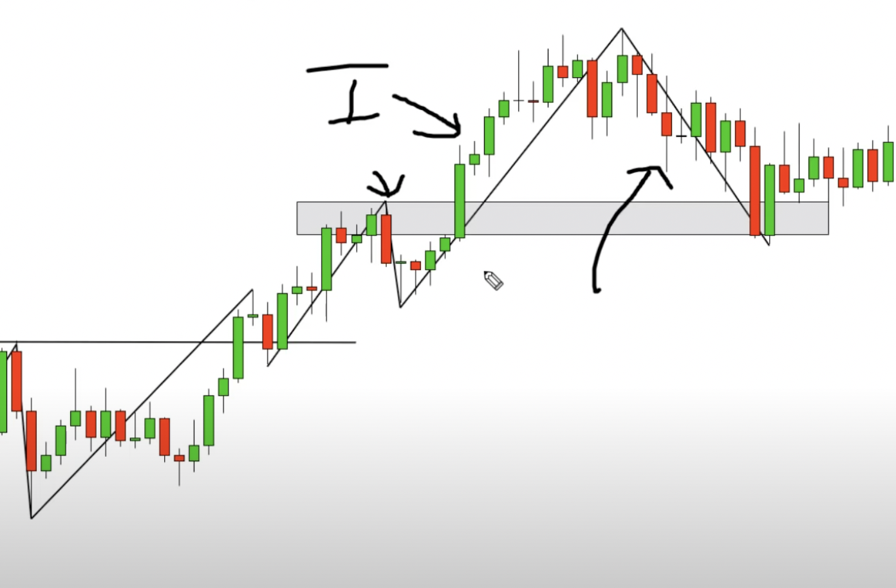
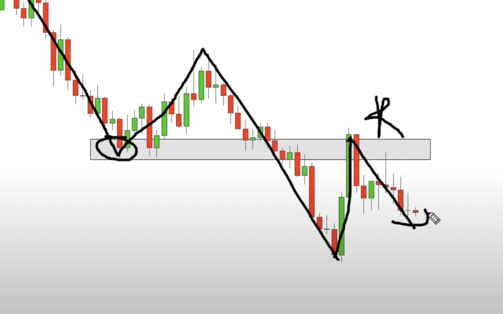
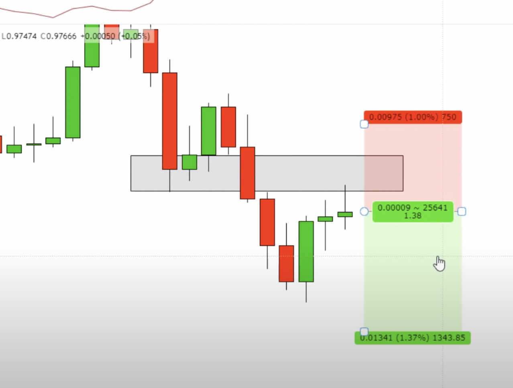

I learned here: https://www.youtube.com/watch?v=eynxyoKgpng

## Trending
Uptrend is when the lowest new low is higher than the previous lowest low.
Downtrend is when the new highest high is still not higher than the previous one.

### Supporting and Resisting range

 In bear market, supporting range is around the previous highest high.

In bull market, resisting range is around the previous lowest low.

## Indicators
### ATR - Average True Range

Is the average pips (height of a candle) of the latest 14 candels. Measures volatility.

It should be used to set up the target price.

### Moving Average
Closing price of the xx number of periods.

Must find the period number that most traders used.

### RSI 
Need to see later.

## Candle stick patterns
Used to:
- Spot reversal
- 
- Entry point

### 38.2% candle
Using fibonancy scale

### Engulfing candle
The 2nd candle fatter than the previous candle and change color.

### Close above/below candle 